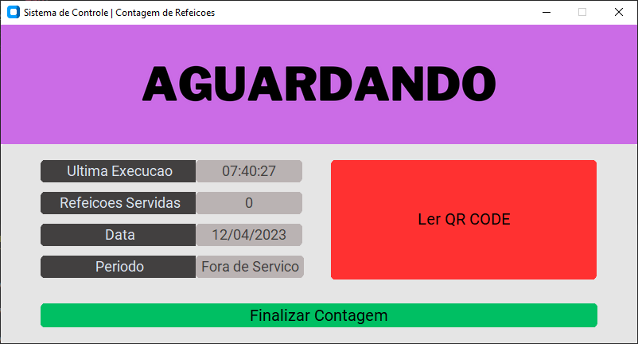
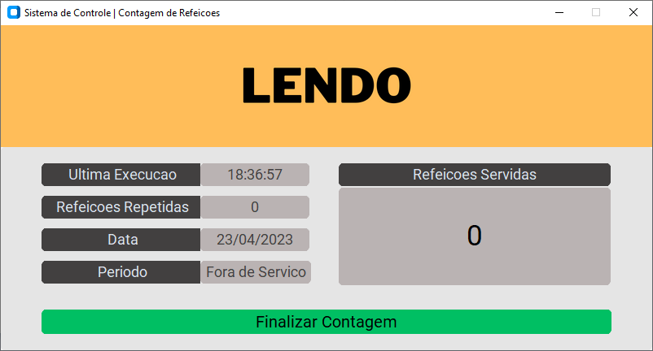
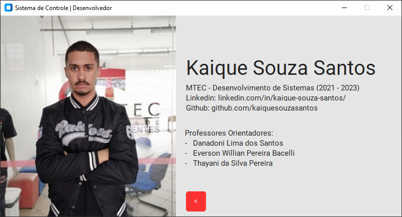
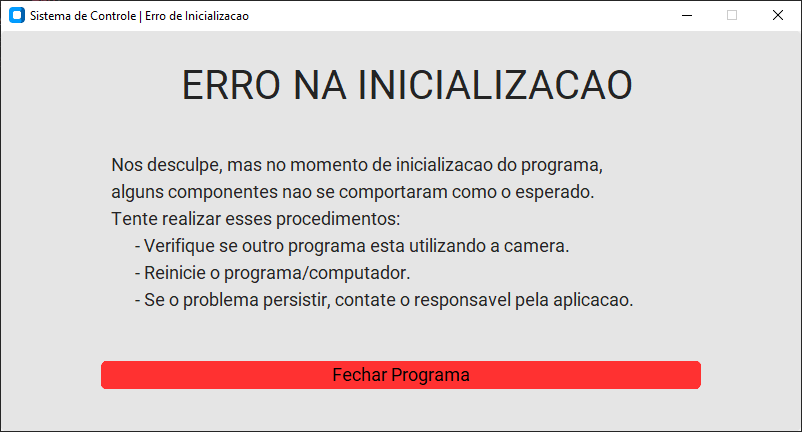

<h1 align=center>🧮 ETEC CIDADE TIRADENTES - GERENCIADOR DE REFEIÇÕES</h1>

<p align="center">
  
</p>

#
### 📚 SOBRE

- Programa desktop desenvolvido com Python, utilizando OpenAI, visando auxiliar no fluxo de consumo alimentício escolar, evitando o desperdício dos mesmos. Utilizando-se de criptografia, mecanismo de notificação, visão computacional, QR Code e processamento assíncrono. 
- O projeto foi solicitado pelo coordenador do curso MTEC-Desenvolvimento de Sistemas na Etec Cidade Tiradentes, Danadoni Lima dos Santos.

#
### ⭐ FUNCIONAMENTO

- *Cadastro de Alunos*: 
    - Realiza a leitura dos alunos, baseados em um arquivo de texto, contendo o email institucional respectivo;
    - Realiza a criacao de um ponto de restauracao, criptografa e gera um QR Code(com o aluno criptografado);
    - Executa o envio do QR Code para o aluno, via E-mail;
    - Todas as informacoes ficam armazenadas em uma pasta protegida.

- *Busca de QR Code Por Email*:
    - Ao ser digitado o Email Institucional do aluno, e realizado a busca do mesmo. Se existente, exibe o QR Code respectivo.

- *Contagem de Refeicoes*:
    - Ao clicar em 'LER QR Code'(manual) ou quando a tela for inicializada(automatico), a leitura do QR Code sera feita, baseada na Web Cam do dispositivo.
    - Dado a alguns mecanimos de tratamento e verificacao, por meio de componentes visuais sao exibidos os estados do processo.

    - Apresenta os seguintes estados:
        - AGUARDANDO: aguardando o inicio da leitura;
        - LENDO: tentando capturar o QR Code;
        - APROVADO: o codigo e correspondido na base de dados(a regra de negocio permite repeticoes de refeicao);
        - NEGADO: o codigo e inexistente na base de dados.

    - Sao exibidas constantemente:
        - A contagem atual de refeicoes servidas;
        - O horario da ultima execucao de leitura;
        - O periodo(Matutino, Vespertino, Noturno) do processo de contagem de refeicoes;
        - A data atual.

    - Ao clicar em 'FINALIZAR CONTAGEM', um arquivo csv sera gerado e disponibilizado no 'Documentos\constagem.csv' do dispositivo, contendo:
        - Data do processo de contagem;
        - Horario de inicio;
        - Horario de termino;
        - Quantidade de refeicoes servidas;
        - Quantidade de repeticoes.

    - Observacoes:
        - Por se tratar de uma aplicacao offline, se durante o processo de contagem, houver alguma interrupcao, ao reiniciar a aplicao, todas as informacoes serao restituidas, dado a um sistema de backup temporario transitivo.

#
### 🖥️ TELAS

<p align="center">
  
  
  
  
  
  
  
</p>

#
### 💻 TECNOLOGIAS

- [Python](https://www.python.org)
- [CV2]()
- [QRCODE]()
- [TKinter]()
- [CustomTKinter]()
- [Thread]()
- [Email]()

#
### 👁️ EXECUCAO

```
python main.py
```

#
### 📋 REQUERIMENTOS

```
# Para o devido funcionamento, instale o Microsoft Visual C++ 2013 Redistributable, baseado em 64 ou 86 bits.
# https://www.microsoft.com/en-US/download/details.aspx?id=40784

pip install pyqrcode
pip install tk
pip install customtkinter
pip install opencv-python
pip install pyzbar
```

#
### 🔗 CONTRIBUIÇÃO

```
$ git clone https://github.com/kaiquesouzasantos/projeto-gerenciador-refeicoes-etec.git
```
